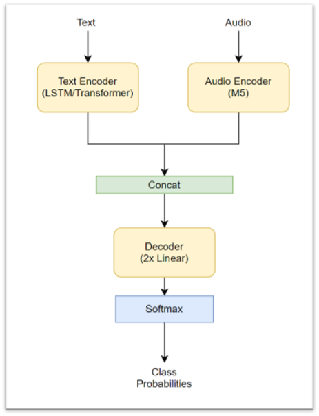
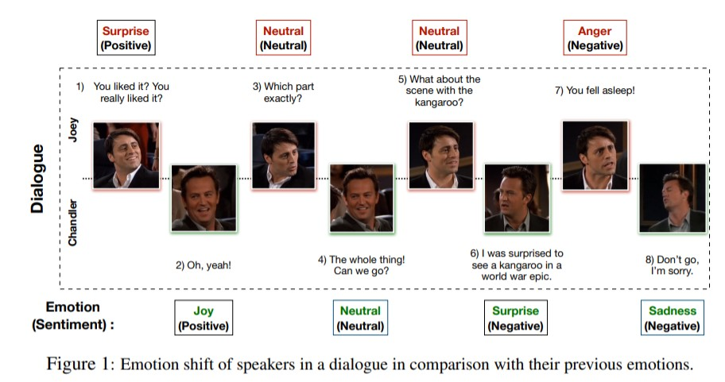
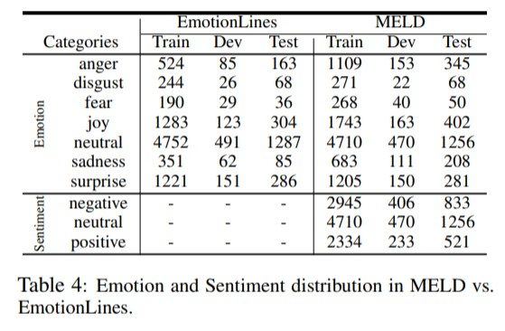
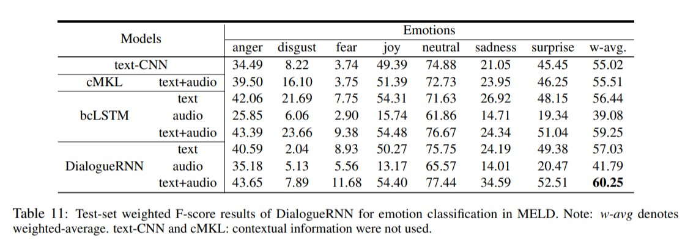

# Multimodal emotion classification
Multimodal emotion classification from the MELD dataset. Developed at the PSI:ML7 Machine Learning Institute by Brando Koch and Nikola Andrić Mitrović under the supervision of Tamara Stanković from Microsoft.

## Setup 
Using Miniconda/Anaconda:
1. `cd path_to_repo`
2. `conda env create`
3. `conda activate multimodal-emotion-detection`

## Multimodal Architecture

## MELD dataset 

Emotion shift phenomenon  

Data distribution  

 
Paper baselines  

## References 
- https://github.com/declare-lab/MELD
- https://arxiv.org/pdf/1810.02508.pdf
